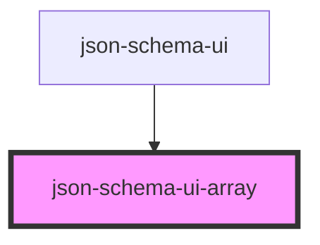

# json-schema-ui-array

<!-- Auto Generated Below -->

## Properties

| Property  | Attribute  | Description | Type               | Default     |
| --------- | ---------- | ----------- | ------------------ | ----------- |
| `keyName` | `key-name` |             | `string`           | `undefined` |
| `schema`  | --         |             | `JSONSchemaObject` | `undefined` |

## Dependencies

### Used by

 - [json-schema-ui](../json-schema-ui)

### Graph

----------------------------------------------

*Built with [StencilJS](https://stenciljs.com/)*
