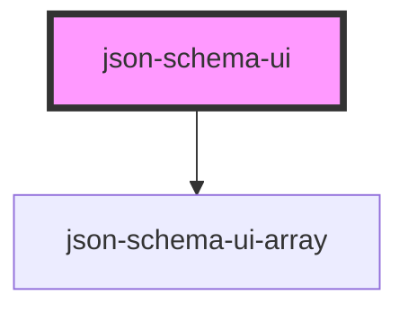

# json-schema-ui

<!-- Auto Generated Below -->

## Properties

| Property | Attribute | Description | Type     | Default     |
| -------- | --------- | ----------- | -------- | ----------- |
| `path`   | `path`    |             | `string` | `undefined` |
| `schema` | `schema`  |             | `string` | `undefined` |

## Dependencies

### Depends on

- [json-schema-ui-array](../json-schema-ui-array)

### Graph

----------------------------------------------

*Built with [StencilJS](https://stenciljs.com/)*
